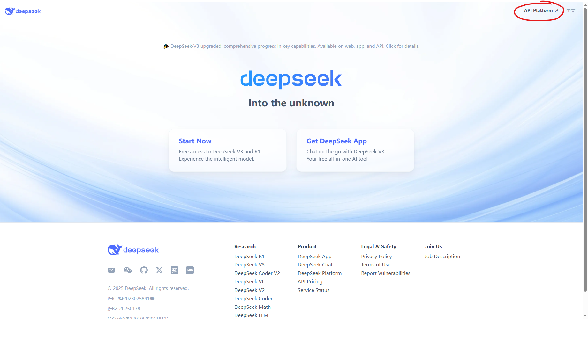
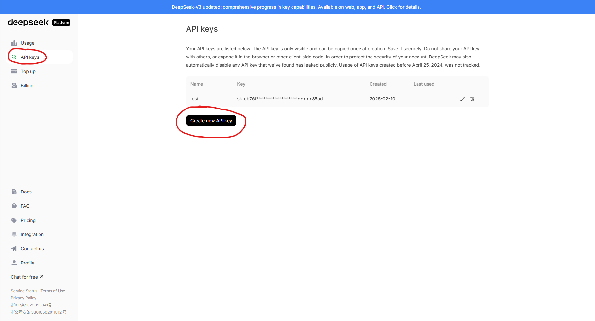

.. _deepseek_api_setup:

Obtaining DeepSeek API Key
=========================

.. contents:: Table of Contents
   :local:
   :depth: 2

Overview
--------
This guide walks through the process of obtaining and configuring your DeepSeek API key for integration with third-party applications.

Prerequisites
-------------
- Active DeepSeek account (register at https://www.deepseek.com/en)

Step 1: Access API Key Section
------------------------------
1. Navigate to the DeepSeek portal: https://www.deepseek.com/en
2. Click API Platform
3. Login to your account

Step 2: Generate New API Key
----------------------------
1. In the left sidebar, click "API Keys"
2. Select "Create new API Key"
3. In the dialog:
   - Enter a name
   - Click "Create API key"

   API key generation interface

Verification
------------
To verify successful integration:

.. code-block:: bash

   curl https://api.deepseek.com/chat/completions \
     -H "Content-Type: application/json" \
     -H "Authorization: Bearer <DeepSeek API Key>" \
     -d '{
           "model": "deepseek-chat",
           "messages": [
             {"role": "system", "content": "You are a helpful assistant."},
             {"role": "user", "content": "Hello!"}
           ],
           "stream": false
         }'

.. code-block:: python

    # Please install OpenAI SDK first: `pip3 install openai`

    from openai import OpenAI

    client = OpenAI(api_key="sk-api here", base_url="https://api.deepseek.com")

    # DeepseekV3: deepseek-chat  DeepseekR1: deepseek-reasoner
    response = client.chat.completions.create(
        model="deepseek-reasoner",
        messages=[
            {"role": "system", "content": "You are a helpful assistant"},
            {"role": "user", "content": "Hello"},
        ],
        stream=False
    )

    print(response.choices[0].message)
Troubleshooting
---------------
.. list-table:: Common Issues
   :widths: 30 70
   :header-rows: 1

   * - Symptom
     - Solution
   * - "Invalid API Key"
     - Regenerate key and re-configure
   * - Rate limiting
     - Check quota at DeepSeek portal
   * - Connection timeout
     - Verify network restrictions

Security Notes
--------------
- Store keys in secure password managers
- Never commit keys to version control
- Rotate keys quarterly
- Restrict keys by IP when possible

Additional Resources
--------------------
- `DeepSeek API Documentation <https://api-docs.deepseek.com/>`_