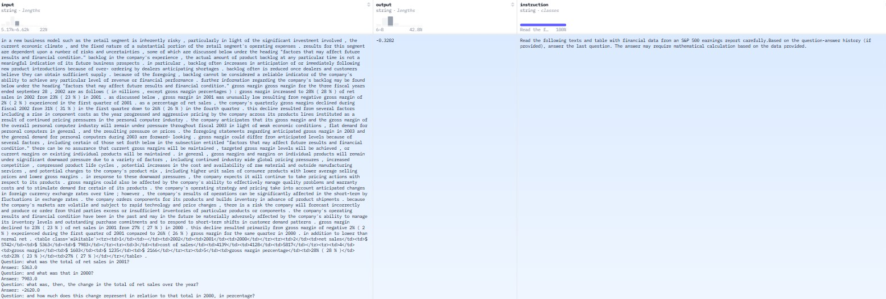

=============
CONVFINQA
=============

.. contents:: Table of Contents
   :local:

Description
============
**CONVFINQA** (Multi-Turn Question Answering in Finance) is a multi‑turn dialogue dataset in the finance domain where models must track conversational context and perform precise numerical reasoning over financial data, with performance measured by Exact Match Accuracy (EmAcc).

Task Description
-------------------
CONVFINQA (Multi-Turn Question Answering in Finance) is a dataset of 3,892 multi‑turn dialogues (14,115 questions) based on real financial reports. Each conversation—either a simple chain of related questions or a hybrid mix of two multi‑hop queries—requires the model to maintain context, decide when to reuse or discard previous answers, and perform complex numerical reasoning over both tables and text using a domain‑specific language. This setup challenges models to handle long‑range dependencies in realistic analyst–client exchanges, with performance measured by Exact Match Accuracy (EmAcc).  

Example dataset(`<https://huggingface.co/datasets/FinGPT/fingpt-convfinqa>`_):

Evaluation Metrics
--------------------

1. Execution Accuracy: The percentage of model answers that exactly match the correct numerical answer.
2. Program Accuracy: The percentage of cases where the model’s generated reasoning steps—its program—are logically equivalent to the annotated, gold‑standard program.

References
------------

.. code-block:: bash

    @article{chen2022convfinqa,
      title={Convfinqa: Exploring the chain of numerical reasoning in conversational finance question answering},
      author={Chen, Zhiyu and Li, Shiyang and Smiley, Charese and Ma, Zhiqiang and Shah, Sameena and Wang, William Yang},
      journal={arXiv preprint arXiv:2210.03849},
      year={2022}
    }