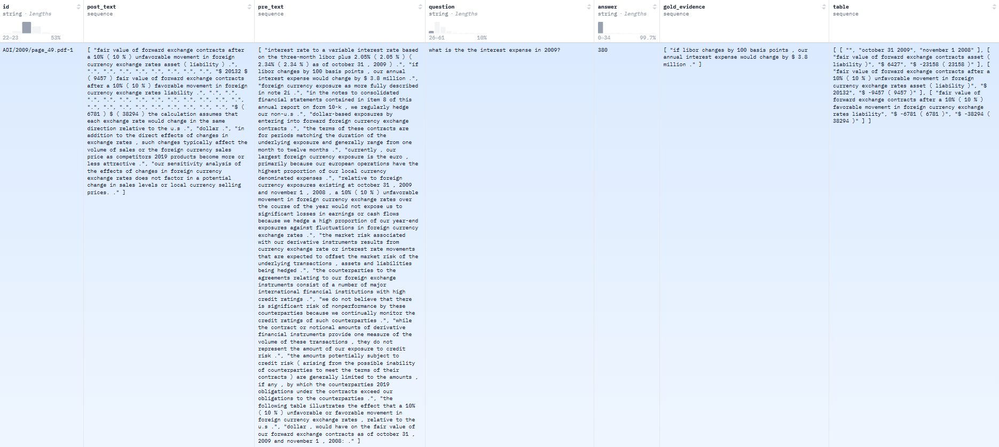

=============
FINQA
=============

.. contents:: Table of Contents
   :local:

Description
============
**FINQA** (Numerical Question Answering in Finance) is a task designed to evaluate a model’s ability to accurately answer numerical questions using information extracted from financial documents (such as balance sheets and income statements), with performance measured primarily by Exact Match Accuracy (EmAcc).

Task Description
-------------------
FINQA (Financial Numerical Question Answering) consists of 8,281 question-answer pairs derived from S&P 500 earnings reports. It challenges models to perform complex numerical reasoning over both financial tables and unstructured text, with each question supported by a detailed gold reasoning program crafted by finance professionals. The dataset is divided into training, validation, and test sets, and is evaluated using both final answer accuracy and the correctness of the reasoning steps.

Example dataset(`<https://huggingface.co/datasets/dreamerdeo/finqa>`_):

Evaluation Metrics
--------------------

1. Execution Accuracy: This metric measures whether the final answer produced by the model is correct.
2. Program Accuracy: This metric evaluates the correctness of the reasoning process by comparing the model-generated reasoning steps to the gold (annotated) reasoning programs.

References
------------

.. code-block:: bash

    @article{chen2021finqa,
      title={Finqa: A dataset of numerical reasoning over financial data},
      author={Chen, Zhiyu and Chen, Wenhu and Smiley, Charese and Shah, Sameena and Borova, Iana and Langdon, Dylan and Moussa, Reema and Beane, Matt and Huang, Ting-Hao and Routledge, Bryan and others},
      journal={arXiv preprint arXiv:2109.00122},
      year={2021}
    }