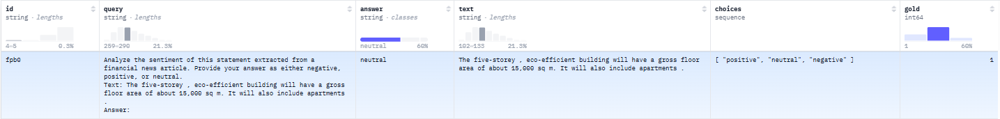

=============
FPB
=============

.. contents:: Table of Contents
   :local:

Description
============
**FPB** (Financial PhraseBank Sentiment Classification) is a sentiment analysis task for financial texts, based on the work by Malo et al. (2014).

Task Description
-------------------
The Financial PhraseBank dataset consists of English sentences selected from financial news about companies listed on the OMX Helsinki Stock Exchange. Key characteristics:

- Contains ~5,000 sentences annotated by 16 finance professionals
- Three sentiment classes: Positive, Negative, Neutral
- Focuses on investor perspective (impact on stock price)
- High inter-annotator agreement (74.9% overall)

Example dataset(`<https://huggingface.co/datasets/ChanceFocus/en-fpb>`_):

Evaluation Metrics
--------------------
1. Accuracy
2. F1-score (macro-averaged)

References
------------

.. code-block:: bash

    @article{malo2014good,
      title={Good debt or bad debt: Detecting semantic orientations in economic texts},
      author={Malo, Pekka and Sinha, Ankur and Korhonen, Pekka and Wallenius, Jyrki and Takala, Pyry},
      journal={Journal of the Association for Information Science and Technology},
      volume={65},
      number={4},
      pages={782--796},
      year={2014},
      publisher={Wiley Online Library}
    }