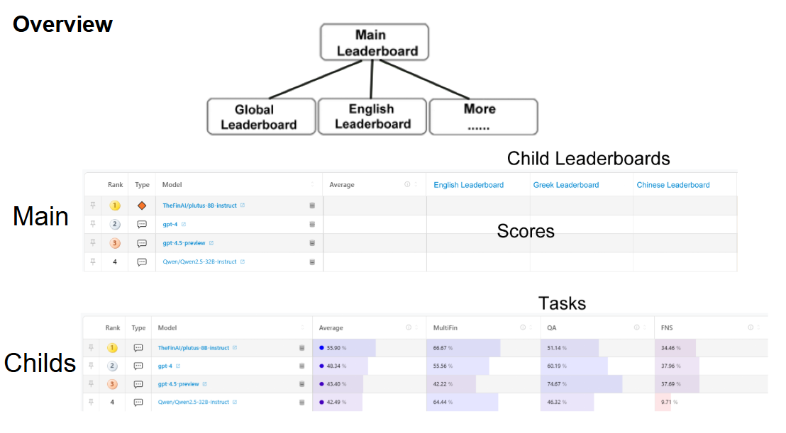

Tre Structure
======================

Overview
--------
Our new leaderboard system features a hierarchical structure with:

1. **Main Leaderboard**: Aggregates performance across all application scenarios
2. **Application-Specific Leaderboards**: Group tasks by real-world use cases

Main Leaderboard
----------------

   Global performance overview showing weighted average scores across all scenarios

Application-Specific Leaderboards
----------------------------------
Each child leaderboard represents a core business application:

.. csv-table:: Application Scenario Leaderboards
   :header: "Scenario", "Description", "Tasks"
   :widths: 15, 30, 30

   "Search Agent", "Enterprise search and information retrieval", "Tasks"
   "AI Tutor", "Educational assistance and content generation", "Tasks"
   "Compliance", "Regulatory monitoring and policy adherence", "Tasks"
   "Auditing", "Financial and operational verification", "Tasks"

Benefits
--------
- **Enterprise Adoption**:
  - Clear mapping to business functions
  - Pre-configured task bundles for common use cases

- **Technical Advantages**:
  - Balanced evaluation across capability domains
  - Dynamic weighting reflects real-world priorities

- **User Experience**:
  - Single-click access to relevant benchmarks
  - Comparable scores across related scenarios
