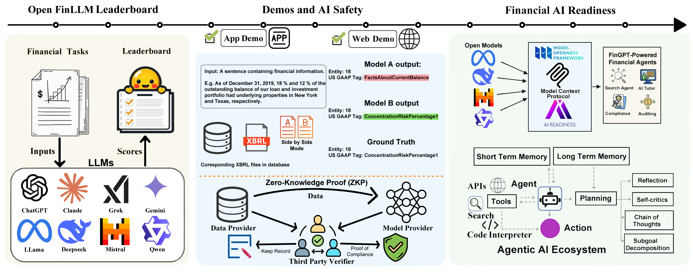

=============
Introduction
=============

.. contents:: Table of Contents
   :local:

Description
============
Welcome to the `Open FinLLM Leaderboard <https://huggingface.co/spaces/finosfoundation/Open-Financial-LLM-Leaderboard>`_!

The OpenFinLLM Leaderboard provides an evaluation framework tailored for financial language models. Through comprehensive benchmarking of 30 LLMs across about 50 financial tasks, we aim to help researchers and practitioners identify the right model for their financial applications.

Our platform offers:

- **Comprehensive Evaluation**: Detailed assessment across seven key financial categories
- **Real-World Relevance**: Benchmarks based on actual financial industry challenges
- **Zero-Shot Testing**: Evaluation of models' ability to generalize to unseen financial tasks
- **Transparent Metrics**: Clear performance metrics for informed model selection

Overview
===========
The growing complexity of financial language models necessitates evaluations that go beyond general NLP benchmarks. While traditional leaderboards focus on broader NLP tasks, they often fall short in addressing the specific needs of the finance industry.

Our goal is to fill this critical gap by providing:

- A transparent framework for assessing model readiness in real-world financial applications
- Specialized evaluation metrics that matter most to finance professionals
- Clear insights into model performance across different financial tasks
- A platform for continuous improvement and innovation in financial AI

Open FinLLM Leaderboard
--------------------------
This section reflects our effort where we collect diverse financial tasks and models from research teams and industries. Models are then evaluated on our leaderboard. Currently there are several opensource evaluation framework for LLMs, but each of them would give a different result even when evaluating the same model using a same dataset. Our goal is to build a reliable benchmarking framework for reference that bridges academic research with practical financial applications.

Demos and AI Safety
-------------------
At the center of the illustration, a side-by-side view is presented. Unlike conventional leaderboards that only display scores, this segment offers an online comparison demo. We show multiple actual model outputs with their corresponding performance scores to help users better understand the real-world implications of these metrics, thereby enhancing transparency and promoting AI safety.

ZKP (Zero-Knowledge Proof)
--------------------------
The lower portion of the Demos and AI Safety introduces the concept of Zero-Knowledge Proof (ZKP). This planned feature aims to protect dataset privacy and prevent fraudulent behaviors such as leaderboard manipulation. With ZKP, we envision a system that can verify model performance without exposing sensitive underlying data, ensuring both integrity and security of the evaluation process.

Financial AI Readiness
----------------------
On the right, this segment embodies the primary objective of the Leaderboard: to build a gateway between academia and industry. By translating complex research achievements into accessible and actionable insights, we foster the growth of the Agentic AI Ecosystem. Much like established industry standards such as MCP and MOF, this section sets the benchmark for financial AI readiness, ensuring that innovations in financial language models are both practical and impactful.

Key Features
============
Task Categories
------------------
The leaderboard evaluates models across seven essential categories:

- Information Extraction (IE)
- Textual Analysis (TA)
- Question Answering (QA)
- Text Generation (TG)
- Risk Management (RM)
- Forecasting (FO)
- Decision-Making (DM)

Each category is designed to assess specific capabilities required in financial applications, from extracting information from regulatory filings to predicting market trends.

Evaluation Metrics
------------------
We employ diverse metrics to provide a comprehensive assessment:

- F1-Score: For balanced evaluation of classification tasks
- Accuracy: For overall performance measurement
- RMSE: For quantitative prediction tasks
- Entity F1 Score: For entity recognition tasks
- ROUGE Score: For text generation evaluation
- Matthews Correlation Coefficient: For binary classification tasks
- Sharpe Ratio: For risk-adjusted return measurement